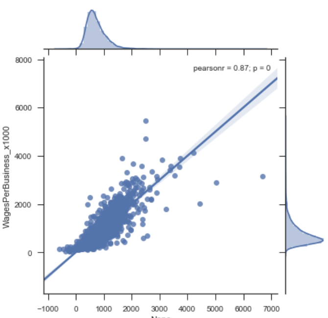

#### William Baum Consulting

## Key Factors for Business Success

I used a multiple linear regression model with multiple features from multiple data sources to describe Number of Businesses and Individual Wages as a function of location and workforce characteristics available in each zip code.  I compared this model with other competing models using backward variable selection.  I used holdback validation to train and compare models, prior to validating and testing them.  Ultimately, I chose the OLS model with the best performance.

The figure depicts the model plotted against the actual data points, and includes a confidence band.

This result identifies multiple important factors in predicting business success as assessed by number of businesses per zip code and employee wages within zip code.
